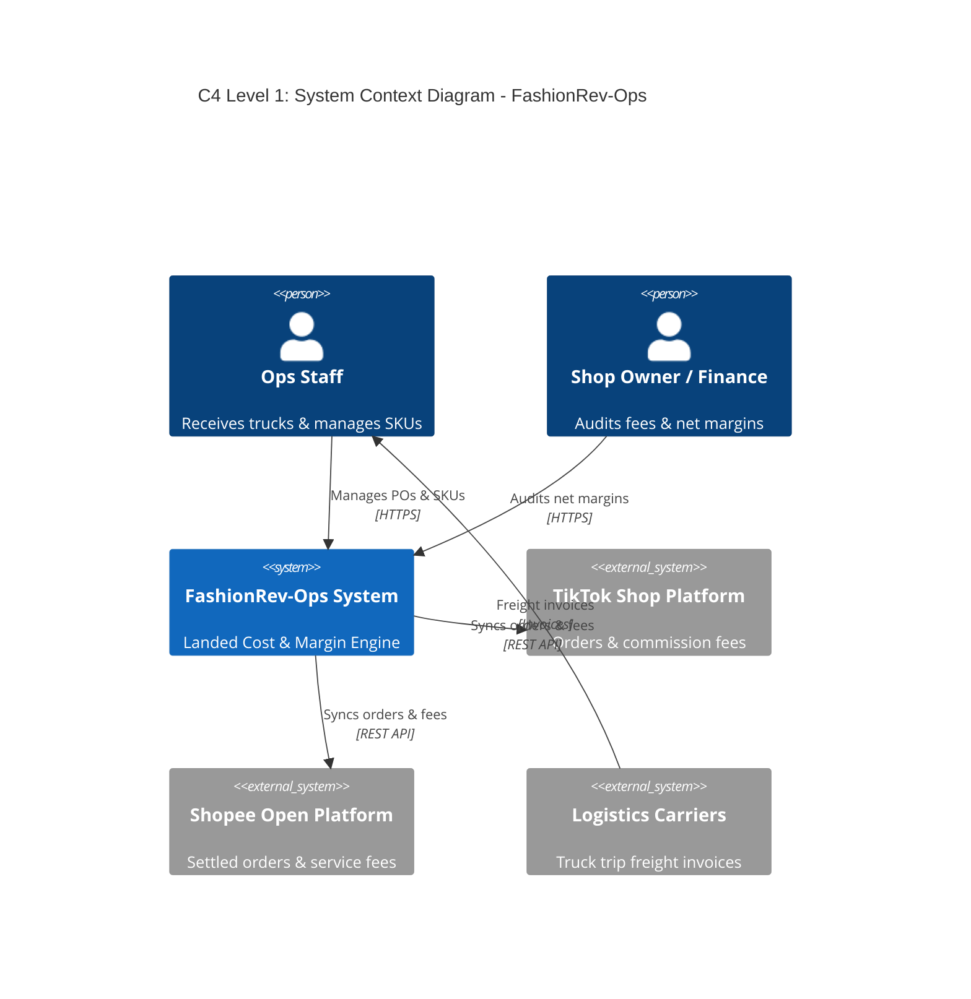
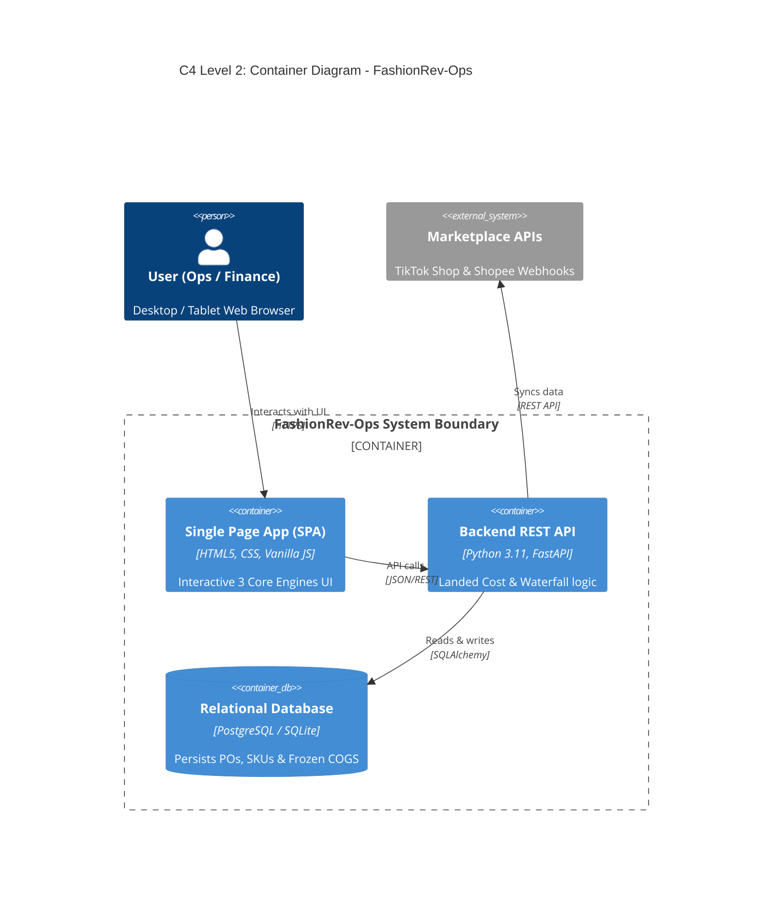
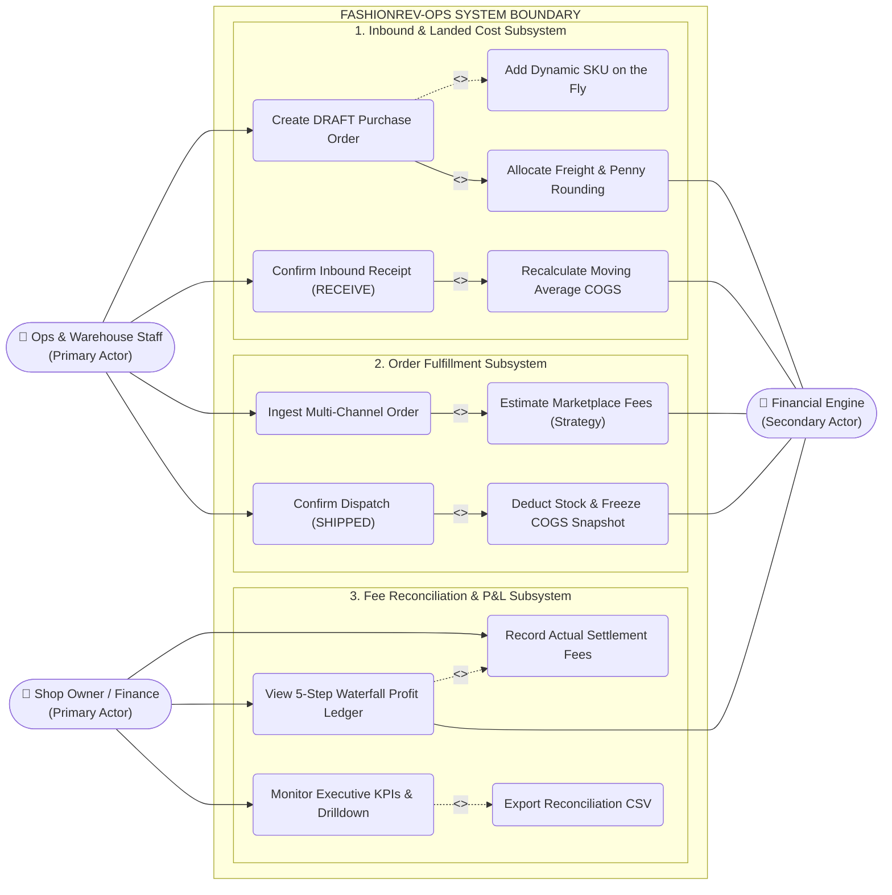
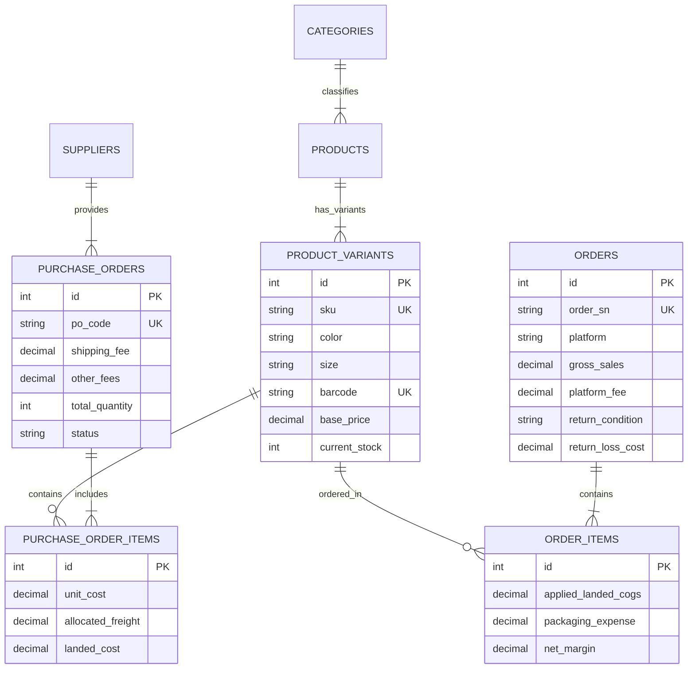

#  FashionRev-Ops: Apparel Cashflow & Net Margin Management System

> **Digital transformation and financial control platform specifically engineered for ready-to-wear fast-fashion e-commerce retail.**  
> **System Architecture:** Standardized under the **C4 Model** (Context, Container, Component, Code) & **ARC42 Framework**. Detailed specification: [docs/architecture/c4_model.md](docs/architecture/c4_model.md).

---

##  System Architecture (C4 Model Standard)

Full architectural breakdown: [docs/architecture/c4_model.md](docs/architecture/c4_model.md) | Architectural Guide: [docs/C4_AND_ARC42_GUIDE.md](docs/C4_AND_ARC42_GUIDE.md)

###  Level 1: System Context Diagram


###  Level 2: Container Diagram


---

## 1. Business Context & Core Pain Points (Top-Down Analysis)

Fast-fashion e-commerce operating under the **pre-stocked / ready-to-wear model** experiences rapid capital turnover but suffers from the highest profit leakage in e-commerce:

1. **Short Trend Lifecycle (2–4 Weeks):** Without variant-level (Size/Color) true landed cost and take-home margin tracking, profits from earlier winning batches get swallowed by slow-moving stock (*"Paper Profit, Negative Cash Flow"*).
2. **Volatile Landed Costs:** Bulk truck freight and port handling fees change every trip. Relying on invoice wholesale prices hides $0.15–$0.30 of freight per item, eroding profit margins silently.
3. **Marketplace Fee Creep:** Commission fees (9%–12%), vouchers, packaging expenses, and weight overcharges eat away gross margins unless audited at the unit level.


---

##  2. The 3 Core Functional Engines (MVP Scope)

Instead of treating the system as a generic ERP, FashionRev-Ops focuses on **3 Core Specialized Engines**:

```
┌──────────────────────────────────────────────────────────────────────────────────┐
│                   FASHIONREV-OPS: 3 CORE FUNCTIONAL ENGINES (MVP)                │
├───────────────────────────────┬──────────────────────────────────────────────────┤
│ 1. Inbound Landed Cost Engine │ 2. Dynamic Inbound SKU Management                │
│    • Automated freight split  │    • Add new fashion models/sizes dynamically    │
│    • Unit Landed Cost formula │    • Pre-calculate landed cost inside modal      │
│    • Landed Cost spotlight    │    • Auto-redistribute freight across batch      │
├───────────────────────────────┴──────────────────────────────────────────────────┤
│ 3. Order Net Profit Waterfall Ledger (Multi-Channel E-Commerce)                  │
│    • 5-step deduction ledger: Paid -> Fees -> Landed COGS -> Packaging           │
│    • Take-home unit net margin % analysis                                        │
│    • Multi-channel filtering: TikTok Shop, Shopee, Facebook POS                  │
└──────────────────────────────────────────────────────────────────────────────────┘
```

###  Feature 1: Inbound Landed Cost Engine (True Warehouse Cost)
* **Business Problem:** Bulk freight and handling fees are paid at the shipment level, not per item.
* **Transparent Mathematical Formula:**
  $$\text{Landed Cost}_{\text{SKU}} = \text{Wholesale Price} + \frac{\text{Truck Freight} + \text{Handling Fees}}{\text{Total Units In Batch}} + \text{Polybag and Tag Fee}$$
* **Interactive UI:** Real-time calculation preview and 3-color stacked cost composition bar (Wholesale 96.1% • Freight 2.6% • Packaging 1.3%).

###  Feature 2: Dynamic Inbound SKU Management (Add New Models On The Fly)
* **Business Problem:** Inbound shipments frequently include unplanned styles, new sizes, or supplementary colorways.
* **Capabilities:**
  - `[ Add New SKU to Batch]` Modal: Enter SKU Code, Variant/Size (`Size S` to `Free Size`), Product Name, Fabric Description, Inbound Qty, and Wholesale Price.
  - **Live Projected Landed Cost:** Previews the exact landed cost inside the modal before adding.
  - **Automatic Freight Re-allocation:** As the batch quantity increases, truck freight is automatically divided across all items, instantly updating landed costs for the entire PO.
  - One-click row removal `[✕]` with automatic freight adjustment and catalog persistence via `POST /api/v1/catalog/variants`.

###  Feature 3: Order Net Profit Waterfall Ledger (Take-Home Unit Margin)
* **Business Problem:** High gross marketplace sales mask severe fee deductions.
* **5-Step Cashflow Waterfall Deduction:**
  $$\text{Customer Paid} \rightarrow -\text{Platform Fees and Vouchers} \rightarrow -\text{Frozen Landed COGS} \rightarrow -\text{Packaging Box} = \mathbf{\text{True Net Profit In Pocket}}$$
* **Multi-Dimensional Filters:** Filter by channel (*TikTok Shop, Shopee, Facebook POS*) and by profitability tier (*High Margin >40%, Low Margin <20%, Loss-making*).

> **Future Scope Roadmap (Phase 2):**  
> *Feature 4: Return Loss Triage & Accounting (Financial Return Allocation)* is scheduled for Phase 2 to focus entirely on core landed cost and net margin transparency for the MVP release.

---

##  3. Roles & Use Case Diagram

Full specification: [docs/usecase.md](docs/usecase.md) | Vietnamese: [docs/usecase_vi.md](docs/usecase_vi.md)

### Actors & Roles
- **Ops & Warehouse Staff:** Creates PO drafts, enters truck freight, dynamically declares unplanned SKUs upon truck unloading, confirms physical receipt (RECEIVE), dispatches orders (SHIPPED).
- **Shop Owner / Finance Manager:** Audits platform fee deductions, inputs actual settlement fees, inspects 5-step waterfall profit ledgers, tracks executive financial KPIs.
- **Financial Calculation Engine (Automated):** Executes penny freight allocation, Moving Weighted Average costing, freezes immutable COGS snapshots, renders waterfall deductions.

### Use Case Diagram (UML Standard)


---

##  4. Information Architecture (IA)

Detailed documentation: [docs/information_architecture.md](docs/information_architecture.md)

```plaintext
INFORMATION ARCHITECTURE (3 TABS)
├── [Tab 1] Overview Dashboard
│   ├── Top 4 Financial KPIs: Gross Sales | Inbound COGS | Platform & Packaging Fees | True Net Profit
│   ├── Inbound Landed Cost Summary Card
│   └── Sales Order Waterfall Stream Card
│
├── [Tab 2] Inbound Landed Cost Engine
│   ├── Breadcrumbs & ERP Sync Controls
│   ├── Left: Batch Parameters (Supplier, Truck Freight, Handling Fee, Polybag Fee)
│   ├── Right: Real-time Allocation Preview (Unit Freight, Landed Cost Spotlight)
│   ├── Interactive SKU Table: Search, Size Filter Pills, [➕ Add New SKU to Batch], [✕] Remove
│   └── Add SKU Modal: Dynamic form with live projected landed cost preview
│
└── [Tab 3] Order Net Profit Waterfall Ledger
    ├── Net Margin & Fulfilled Volume KPI Pills
    ├── Channel Toolbar: All Channels | TikTok Shop | Shopee | Facebook POS
    └── Waterfall Ledger Table: 7 columns tracking deductions from Revenue to Pocketed Cash
```

---

##  5. UI/UX Screenshots & Interface

Designed with a clean, modern **Light SaaS aesthetic** and fully English-localized:

### 5.1. Overview Dashboard


### 5.2. Inbound Landed Cost Engine


### 5.3. Order Net Profit Waterfall Ledger


---

##  6. Database Design (DBML & ERD)

- DBML Schema File: [docs/schema.dbml](docs/schema.dbml)  
  *(Paste this file into [dbdiagram.io](https://dbdiagram.io/) for interactive relational diagrams).*
- SQL DDL File: `init-scripts/01_schema.sql` (PostgreSQL 16).



---

##  7. Getting Started

### Prerequisites
- Python 3.11+
- Docker & Docker Compose (for PostgreSQL 16)
- Modern Web Browser (Chrome, Edge, Safari)

### Quick Run
```bash
# 1. Start PostgreSQL Database
docker compose up -d

# 2. Install dependencies & start FastAPI backend
pip install -r requirements.txt
python -m uvicorn backend.app.main:app --host 0.0.0.0 --port 8088 --reload

# 3. Access Web Application
# Frontend UI: http://localhost:8088/
# Swagger Docs: http://localhost:8088/docs
```

---

