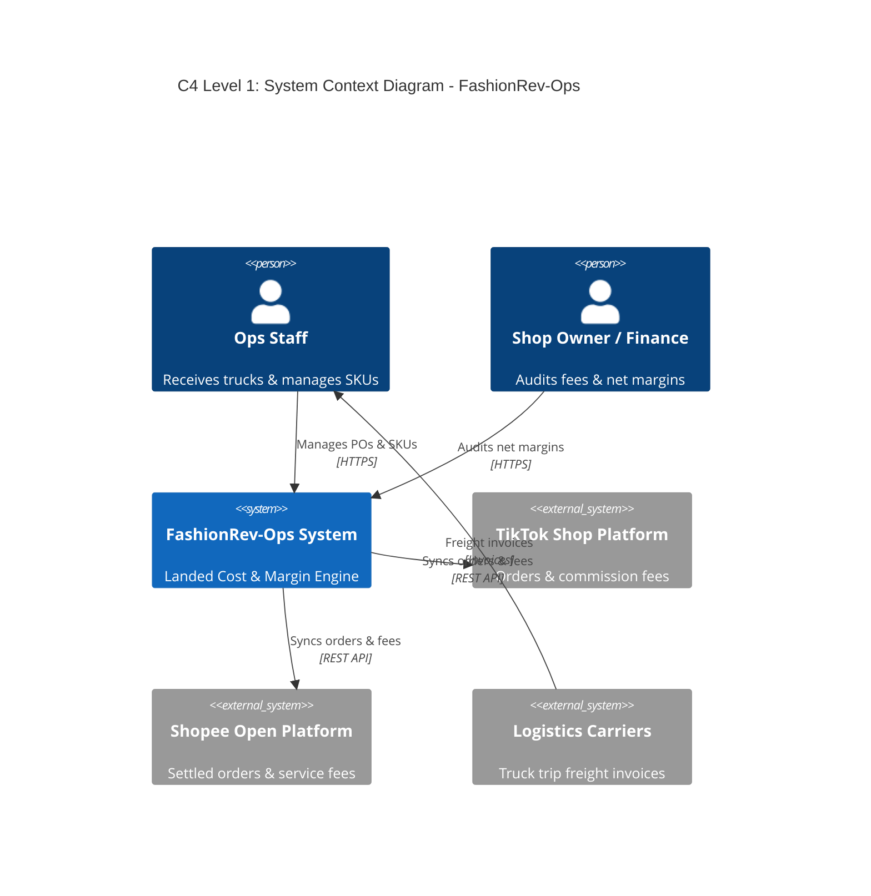
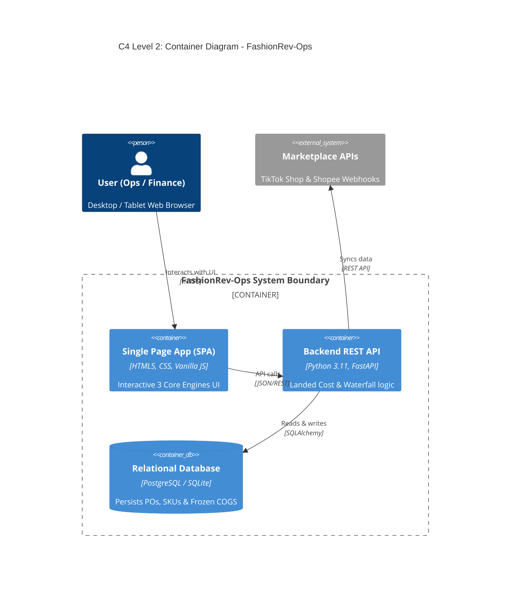
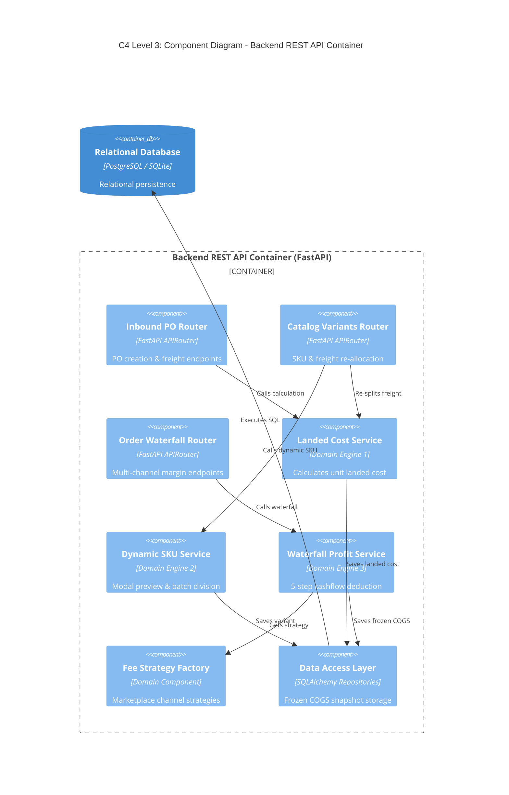
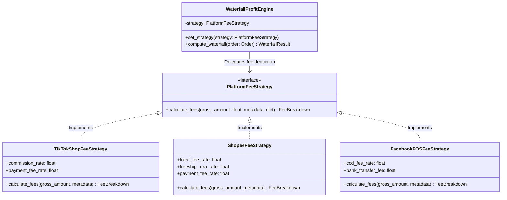

# System Architecture Specification (C4 Model Standard)
## FashionRev-Ops: Apparel Cashflow & Net Margin Management System

> **Project:** FashionRev-Ops  
> **Architecture Version:** 1.0 (C4 Standardized)  
> **Reference Mindmap:** [C4_mindmap.xmind](../../C4_mindmap.xmind)

---

## 1. Overview of the C4 Model Approach

**FashionRev-Ops** adopts the **C4 Model** (founded by Simon Brown) to visualize software architecture hierarchically across 4 distinct abstraction levels:
1. **Level 1 - System Context (100% Recommended):** The high-level panorama answering: *Who uses the system and what external systems does it depend on?*
2. **Level 2 - Container (100% Recommended):** High-level technical footprint delineating independent runtime boundaries (process spaces).
3. **Level 3 - Component (Applied to Complex Logic):** Zooming into the Backend API Container to break down the 3 Core Financial Engines (*Inbound Landed Cost Engine, Dynamic SKU Batch Management, Order Waterfall Profit Ledger*).
4. **Level 4 - Code & Design Patterns (Key Architectural Patterns):** Focused specifically on mission-critical algorithms: **Strategy Pattern** for multi-channel marketplace fee calculation and **Frozen COGS Snapshot Pattern** for accounting immutability.

---

## 2. Level 1: System Context Diagram

### 2.1. System Context Diagram (Mermaid C4Context)



### 2.2. Context Elements Description

| Element | Type | Role & Responsibilities | Interaction Protocol |
| :--- | :---: | :--- | :--- |
| **Ops & Warehouse Staff** | Person | Creates inbound Purchase Orders (POs), inputs bulk freight costs, dynamically adds new variants upon unloading, and prints barcode price tags. | Web Browser (HTTPS) |
| **Shop Owner / Finance Manager** | Person | Audits financial KPIs, tracks take-home net margin percentages, inspects order waterfall deductions, and optimizes catalog profitability. | Web Browser (HTTPS) |
| **FashionRev-Ops System** | Software System | Core apparel financial management platform owned and maintained by our engineering team. Automates landed cost and net profit waterfalls. | HTTPS / REST / SQL |
| **TikTok Shop Platform** | External System | E-commerce channel delivering order webhooks, marketplace commission, payment processing fees, and voucher subsidies. | HTTPS REST API |
| **Shopee Open Platform** | External System | E-commerce channel providing settled order reports, transaction fees, Freeship Xtra service fees, and commission data. | HTTPS REST API |
| **Truck Freight & Logistics** | External Actor / System | Inter-provincial truck shipping carriers providing shipment-level freight invoices. | Invoices / Digital Receipts |

---

## 3. Level 2: Container Diagram

In alignment with Simon Brown's core principles, the **Client SPA and Server API are strictly separated into two distinct Containers** because they operate in separate process spaces (Client Browser vs. Server Uvicorn Process) and communicate remotely over HTTP.

### 3.1. Container Diagram (Mermaid C4Container)



### 3.2. Container Specifications

| Container | Technology Stack | Runtime Environment | Core Responsibilities |
| :--- | :--- | :--- | :--- |
| **Single Page Application (SPA)** | HTML5, Vanilla CSS (Custom Design System), ES6 JS Modules | Client Web Browser (`frontend/`) | • Renders 3 Core Functional Engines.<br>• Live projected landed cost preview inside Modal.<br>• Real-time 3-color stacked cost composition bar. |
| **Backend REST API Server** | Python 3.11, FastAPI, Pydantic, Uvicorn | Server / Docker Container Port 8000 (`backend/app/`) | • Exposes standardized RESTful endpoints.<br>• Enforces schema validation using Pydantic DTOs.<br>• Executes mathematical formulas for the 3 Core Engines. |
| **Relational Database** | PostgreSQL 15+ / SQLite 3 | Database Container / Port 5432 | • Stores relational schemas defined in [docs/schema.dbml](../schema.dbml).<br>• Enforces financial immutability via `frozen_landed_cost` snapshots. |

---

## 4. Level 3: Component Diagram (Backend API Internals)

Zooming directly into the **Backend REST API Container** reveals how the internal components are partitioned into clean architectural layers:

### 4.1. Component Diagram (Mermaid C4Component)



### 4.2. Component Responsibilities


| Component | Source Path | Core Architectural Responsibility |
| :--- | :--- | :--- |
| **Inbound PO Router** | `backend/app/api/v1/purchase_orders.py` | Handles incoming PO requests and validates shipment freight parameters. |
| **Catalog Variants Router** | `backend/app/api/v1/products.py` | Manages variant additions, SKU code validation, and dynamic batch adjustments. |
| **Order Waterfall Router** | `backend/app/api/v1/orders.py` | Exposes filtering by sales channel (*All, TikTok Shop, Shopee, FB POS*) and margin tiers. |
| **Landed Cost Service** | `backend/app/services/landed_cost_service.py` | Implements formula: $\text{Landed Cost} = \text{Wholesale} + \frac{\text{Freight} + \text{Handling}}{\sum \text{Batch Units}} + \text{Packaging}$. |
| **Dynamic SKU Service** | `backend/app/services/product_service.py` | Powers real-time projected landed cost inside Modal and reallocates batch freight. |
| **Waterfall Profit Service** | `backend/app/services/order_service.py` | Breaks down cashflow waterfall and classifies net margin percentages. |
| **Platform Fee Strategy** | `backend/app/services/fee_strategies/` | Encapsulates marketplace fee deduction rules per channel using Strategy Pattern. |
| **Data Access Layer** | `backend/app/models/` | Guarantees transactional consistency and writes immutable `frozen_landed_cost` snapshots. |

---

## 5. Level 4: Code Diagram & Design Patterns

Adhering to Simon Brown's guidance: **We avoid manually drawing complete class diagrams for transient code.** Instead, we model the **2 mission-critical architectural patterns**:

### 5.1. Strategy Pattern: Multi-Channel Marketplace Fee Deduction

#### Class Diagram (Mermaid)


#### Architectural Rationale:
* **Compliance with Open/Closed Principle (SOLID):** When Shopee or TikTok updates their fee policies (e.g., modifying commission rates or voucher sharing), or when expanding to new channels (Lazada, Tiki), we create a new strategy class without modifying the core waterfall calculation engine.

---

### 5.2. Frozen COGS Snapshot Pattern: Financial Immutability

#### Mathematical Cashflow Waterfall:
$$\text{Take-Home Net Profit} = \text{Customer Paid} - \text{Platform Fees} - \text{Vouchers} - \mathbf{\text{Frozen Landed COGS}} - \text{Packaging Box}$$

#### Accounting Invariant:
* At the moment an order is dispatched and settled, the SKU's active `Landed Cost` is permanently snapshotted into `order_items.frozen_landed_cost`.
* Subsequent batch shipments with fluctuating truck freight **never retroactively alter historical order profitability**, preventing accounting audit discrepancies.

---

## 6. C4 Model Mapping to Repository Layout

```
C4 Model Level                  Project Location
─────────────────────────────────────────────────────────────────────────────
Level 1: System Context         docs/architecture/c4_model.md & README.md
Level 2: Container              frontend/ (SPA) & backend/ (REST API) & PostgreSQL
Level 3: Component              backend/app/api/v1/ & backend/app/services/
Level 4: Code & Patterns        backend/app/services/ & backend/app/models/
```
