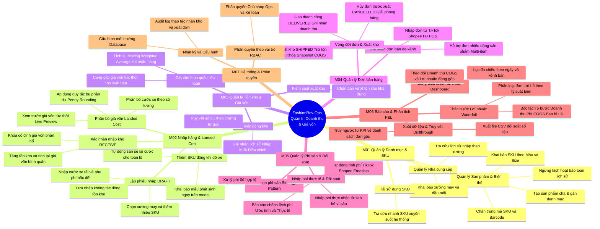
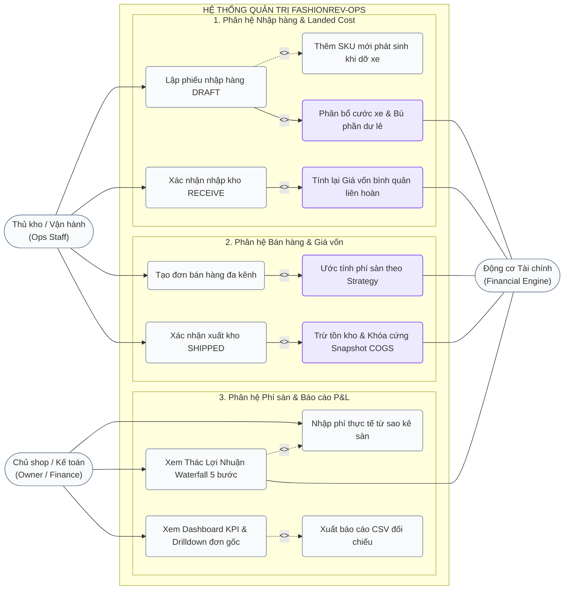
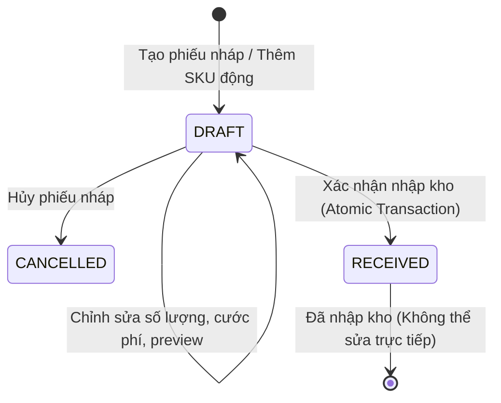
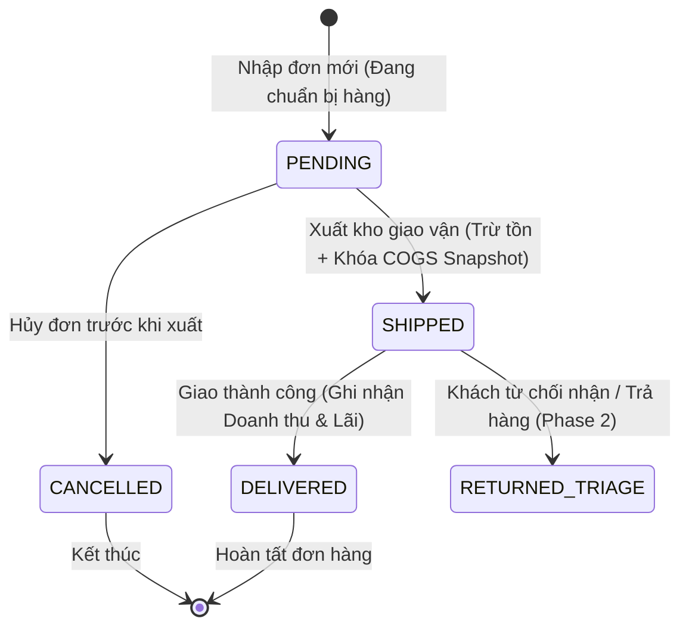

# Đặc tả Use Cases, Vai trò & Quy tắc Nghiệp vụ (v2 Baseline)

---

## 1. System Mindmap Diagram (Sơ đồ Tư duy 3 Tầng)

Cấu trúc phân rã chuẩn: **Modules $\rightarrow$ Features $\rightarrow$ Functions / User Stories**.

---

## 2. Use Case Diagram (Sơ đồ Use Case Chuẩn UML)

---

## 3. Bảng Phân Vai Tác Nhân (Actor & Role Specifications)

| Actor (Tác nhân) | Phân loại vai trò | Trách nhiệm chính trong hệ thống |
|---|---|---|
| **Thủ kho / Vận hành** *(Ops Staff)* | Primary Actor (Nghiệp vụ kho) | Khai báo SKU mới, lập phiếu nhập kho DRAFT, nhập cước xe, xác nhận nhận kho thực tế (RECEIVE), xuất đơn bán hàng (SHIPPED). |
| **Kế toán / Tài chính** *(Finance Manager)* | Primary Actor (Nghiệp vụ tài chính) | Giám sát Thác nước Lợi nhuận (Waterfall), nhập phí sàn thực tế từ sao kê ví để đối soát, kiểm tra chi phí bao bì, xuất báo cáo P&L. |
| **Chủ shop** *(Shop Owner / Admin)* | Primary Actor (Quản trị) | Giám sát Dashboard 4 chỉ số KPI tổng thể, phê duyệt điều chỉnh kho, phân quyền người dùng và quản trị hệ thống. |
| **Động cơ Tài chính** *(Financial Engine)* | Secondary Actor (Hệ thống tự động) | Tự động phân bổ cước xe (Penny Allocation), tính giá vốn bình quân (Moving Weighted Average), khóa snapshot COGS, bóc tách thác lợi nhuận 5 bước. |

---

## 4. Ma Trận Ranh Giới Phạm Vi Chức Năng (Functional Scope Matrix)

| Module trong Mindmap | Tính năng trong phạm vi MVP (In-Scope) | Chủ động loại trừ / Để Phase 2 (Out-of-Scope) |
|---|---|---|
| **1. Danh mục & SKU (M01)** | • CRUD Sản phẩm, Biến thể Màu/Size, Nhà cung cấp. • Chặn trùng mã SKU/Barcode. • Ngừng kích hoạt bảo toàn lịch sử. | • Quản lý định mức phụ liệu may mặc (BOM). • Quản lý danh mục đa công ty / đa thương hiệu. |
| **2. Nhập hàng & Landed Cost (M02)** | • Lập phiếu DRAFT, Thêm SKU động khi dỡ xe. • Phân bổ cước xe + bao bì nhập theo số lượng (Penny rounding). • Live preview giá vốn tức thì trên modal. • Xác nhận nhận kho 1 lần (Idempotent & Atomic). | • Quy trình nhận hàng từng phần (Partial Inbound). • Quản lý công nợ mua hàng nhà cung cấp nâng cao. |
| **3. Tồn kho & Giá vốn (M03)** | • Sổ biến động kho (Nhập/Xuất/Điều chỉnh). • Giá vốn bình quân liên hoàn (Moving Weighted Average). • Khóa Snapshot COGS khi SHIPPED. • Chặn xuất bán vượt tồn khả dụng. | • Quản lý đa kho vật lý / sơ đồ giá kệ. • Phân tích hạn sử dụng và tuổi tồn chi tiết theo lô vị trí. |
| **4. Đơn bán hàng (M04)** | • Nhập thông tin đơn từ TikTok Shop, Shopee, FB POS. • Đơn nhiều dòng sản phẩm (Multi-item Order). • Vòng đời đơn: `PENDING` $\rightarrow$ `SHIPPED` $\rightarrow$ `DELIVERED` / `CANCELLED`. | • Đồng bộ tự động thời gian thực qua Open API / Webhook sàn. • Phân luồng đóng gói tự động (Wave picking). |
| **5. Phí sàn & Đối soát (M05)** | • Ước tính phí sàn Shopee/TikTok/FB POS theo Strategy Pattern. • Nhập phí thực tế đối soát từ sao kê ví. • Xử lý phí 0đ hợp lệ. | • Tự động import và phân tích file Excel sao kê ví hàng loạt. • Kết nối trực tiếp tài khoản ngân hàng doanh nghiệp. |
| **6. Báo cáo & Phân tích (M06)** | • Thác nước Lợi nhuận 5 bước theo từng đơn hàng. • Phân loại đơn: Lãi cao (>40%), Lãi mỏng (<20%), Đơn lỗ (<0%). • Dashboard KPI lọc theo ngày/kênh bán. • Drillthrough truy vết đơn gốc và xuất CSV. | • Báo cáo Lợi nhuận ròng toàn shop sau Chi phí vận hành M09 (Mặt bằng, Lương, Quảng cáo). • Dự báo doanh số bằng mô hình AI/ML. |
| **7. Hệ thống & Phân quyền (M07)** | • Phân quyền 3 vai trò: Chủ shop (Owner), Thủ kho (Ops), Kế toán (Finance). • Ghi nhật ký Audit Log cho thao tác Nhập/Xuất kho. • Tùy chọn cấu hình Database (.env) rõ ràng. | • Đăng nhập một chạm SSO (Google OAuth, LDAP). • Đa người thuê (Multi-tenant SaaS). |
| **8. Hoàn hàng & Tổn thất (M08)** | *Loại trừ khỏi MVP* | • Toàn bộ quy trình tiếp nhận hàng hoàn, phân loại tái nhập kho hoặc ghi giảm giá trị tổn thất (Chuyển sang Phase 2). |

---

## 5. Bản đồ Vai trò & Ma trận Phân quyền (RBAC)

| Mã vai trò | Tên vai trò | Trách nhiệm chính | Màn hình truy cập chính |
|---|---|---|---|
| **ROLE_OWNER** | Chủ Shop / Quản trị | Toàn quyền kiểm soát tài chính, cấu hình hệ thống, duyệt điều chỉnh kho và xem báo cáo tổng thể. | Toàn bộ hệ thống, Dashboard P&L, Cấu hình. |
| **ROLE_OPS** | Thủ kho / Vận hành | Khai báo SKU, lập và nhận phiếu nhập kho, theo dõi tồn kho, tạo và xác nhận xuất đơn bán hàng. | Màn hình Nhập hàng, Danh mục SKU, Danh sách Đơn hàng. |
| **ROLE_FINANCE** | Kế toán / Tài chính | Nhập và đối soát phí sàn, kiểm tra chi phí bao bì, phân tích biên lợi nhuận đơn và chốt kỳ báo cáo. | Chi tiết Đơn hàng, Phí & Đối soát, Báo cáo Lợi nhuận Waterfall. |

### Ma trận quyền (Permission Matrix) theo Module

| Module / Hành động | Quyền API | OPS | FINANCE | OWNER | Ghi chú kiểm soát |
|---|---|:---:|:---:|:---:|---|
| **M01: Danh mục & SKU** | `catalog:read` / `write` |  /  |  /  |  /  | Ops tạo SKU; chỉ Owner có quyền ngừng sử dụng |
| **M02: Tạo phiếu nhập DRAFT** | `po:create_draft` |  |  |  | Lưu nháp chưa làm thay đổi tồn kho |
| **M02: Nhận kho PO (RECEIVE)** | `po:receive` |  |  |  | Tăng tồn, cập nhật giá vốn bình quân (Idempotent) |
| **M03: Điều chỉnh tồn thủ công** | `stock:adjust` |  |  |  | Bắt buộc có lý do và chứng từ điều chỉnh |
| **M04: Tạo & Sửa đơn bán** | `order:create` / `update` |  |  |  | Nhập thông tin đơn từ các kênh bán |
| **M04: Xuất kho đơn (SHIP)** | `order:ship` |  |  |  | Trừ tồn khả dụng, khóa cứng snapshot COGS |
| **M05: Nhập phí thực tế sàn** | `fee:record_actual` |  |  |  | Ghi đè biểu phí ước tính bằng số thực nhận |
| **M06: Xem báo cáo P&L / Margin**| `analytics:view` |  |  |  | Ops không xem biên lãi ròng chi tiết |
| **M07: Cấu hình shop & DB** | `admin:system` |  |  |  | Chỉ Owner có quyền đổi cấu hình |

---

## 2. Máy trạng thái (State Machines) & Vòng đời giao dịch

### 2.1 Vòng đời Phiếu Nhập Hàng (Purchase Order - PO)

* **DRAFT (Nháp):** Đang kiểm đếm, thêm bớt SKU, chỉnh sửa cước xe/phụ phí. **Chưa tác động vào số lượng tồn kho.**
* **RECEIVED (Đã nhận hàng):**
  * Tăng số lượng tồn kho `current_stock` theo từng SKU.
  * Tính lại **Giá vốn bình quân gia quyền liên hoàn** cho từng SKU.
  * Khóa cứng (freeze) toàn bộ chi phí phân bổ trên dòng PO (`landed_cost`).
  * Giao dịch là **Atomic** (nếu lỗi 1 dòng thì rollback toàn bộ) và **Idempotent** (gửi lại không cộng kho lần 2).
* **CANCELLED (Đã hủy):** Hủy phiếu nháp, không phát sinh giao dịch tồn kho.

---

### 2.2 Vòng đời Đơn Bán Hàng (Order)

* **PENDING (Chờ xử lý / Đã chốt):** Đơn vừa nhập vào hệ thống. Có thể giữ chỗ tồn kho (Reserved) nếu cấu hình.
* **SHIPPED (Đã xuất kho / Đang giao):**
  * **Trừ tồn kho thực tế** (`current_stock = current_stock - quantity`).
  * **Khóa snapshot giá vốn:** Gán cố định `applied_landed_cogs = current_avg_cogs` tại đúng thời điểm xuất. Khi nhập lô hàng mới sau này với giá khác, snapshot này **không bao giờ bị thay đổi**.
* **DELIVERED (Đã giao hàng thành công):**
  * Ghi nhận Doanh thu chính thức (`gross_sales`) và ghi nhận vào Báo cáo Lợi nhuận kỳ này.
* **CANCELLED (Đã hủy trước xuất):** Hủy đơn, không phát sinh chi phí xuất kho và giải phóng tồn giữ chỗ.

---

## 3. Quy tắc Kế toán & Công thức Tính toán Tài chính

### 3.1 Công thức Phân bổ Giá vốn Nhập kho (Landed Cost Allocation)

Giá vốn nhập kho của một đơn vị SKU trong lô nhập gồm 3 thành phần:
$$\text{Landed Cost}_{\text{SKU}} = \text{Đơn giá mua} + \text{Cước phân bổ} + \text{Bao bì nhập}$$

Trong đó:
$$\text{Cước phân bổ mỗi chiếc} = \frac{\text{Tổng cước vận chuyển (Truck Freight)} + \text{Phụ phí bốc dỡ/kiểm đếm (Handling)}}{\sum \text{Số lượng toàn bộ lô nhập}}$$

#### Quy tắc làm tròn & Bù phần lẻ (Penny Allocation Rule):
* Đơn vị tiền tệ chuẩn: **VND (Số nguyên, không có số thập phân lẻ)**.
* Khi chia cước phát sinh số dư lẻ (ví dụ: cước 100.000đ chia cho 3 chiếc = 33.333,33đ/chiếc):
  * Dòng 1: `33.333đ`
  * Dòng 2: `33.333đ`
  * Dòng 3 (Dòng cuối): `33.334đ` (bù phần dư 1đ)
  * **Bất biến:** $\sum \text{Allocated Freight} = \text{Total Freight Inbound}$.

---

### 3.2 Thuật toán Giá vốn Bình quân Gia quyền Liên hoàn (Moving Weighted Average)

Mỗi khi phiếu nhập chuyển trạng thái `RECEIVED`, giá vốn bình quân mới của từng biến thể SKU được tính lại ngay lập tức:

$$\text{Avg Cost}_{\text{mới}} = \frac{(\text{Tồn trước nhập} \times \text{Avg Cost}_{\text{hiện tại}}) + (\text{Số lượng nhập} \times \text{Landed Cost}_{\text{lô mới}})}{\text{Tồn trước nhập} + \text{Số lượng nhập}}$$

#### Ví dụ chuẩn kiểm thử (Test Case Baseline):
1. **Lô 1:** Tồn kho ban đầu = 0. Nhập **100 chiếc** Áo Thun Đen size M với Landed Cost = **78.000đ/c**.  
   $\rightarrow$ Tồn kho = 100 chiếc, Giá vốn bình quân = **78.000đ/c**.
2. **Đơn bán 1:** Xuất bán **30 chiếc** (Trạng thái `SHIPPED`).  
   $\rightarrow$ Tồn kho còn = 70 chiếc. Snapshot giá vốn cho Đơn bán 1 = **78.000đ/c**.
3. **Lô 2:** Nhập thêm **80 chiếc** với Landed Cost mới (do tăng cước xe) = **85.000đ/c**.  
   $$\text{Avg Cost}_{\text{mới}} = \frac{(70 \times 78.000) + (80 \times 85.000)}{70 + 80} = \frac{5.460.000 + 6.800.000}{150} = \frac{12.260.000}{150} = \mathbf{81.733đ/c}$$
   $\rightarrow$ Tồn kho = 150 chiếc, Giá vốn bình quân mới = **81.733đ/c**.
4. **Kiểm tra tính bất biến:** Đơn bán 1 (đã xuất trước đó) **vẫn giữ nguyên snapshot 78.000đ/c**, không bị nhảy số liệu!

---

### 3.3 Thác Lợi Nhuận 5 Bước (Order Net Profit Waterfall)

Lợi nhuận thực nhận trên từng đơn hàng được bóc tách rành mạch qua 5 bước:

$$\begin{aligned}
\text{Bước 1 (Tổng thu)} &: \text{Tiền khách trả (Gross Sales)} \\
\text{Bước 2 (Trừ phí sàn \& trợ giá)} &: - \text{Phí hoa hồng / dịch vụ sàn (Platform Fee)} \\
& - \text{Voucher shop chịu (Voucher Discount)} \\
& - \text{Phí ship shop chịu (Shop Shipping Fee)} \\
\rightarrow \text{Số tiền sàn quyết toán} &: = \text{Net Settlement Amount} \\
\text{Bước 3 (Trừ giá vốn xuất)} &: - \sum (\text{Applied Landed COGS} \times \text{Quantity}) \\
\text{Bước 4 (Trừ bao bì đóng gói)} &: - \sum (\text{Packaging Box \& Tape Expense} \times \text{Quantity}) \\
\text{Bước 5 (Trừ tổn thất hoàn - P2)} &: - \text{Return Loss Cost (0đ trong MVP)} \\
\mathbf{\rightarrow \text{Lợi Nhuận Thực Nhận Vào Túi}} &: = \mathbf{\text{True Net Profit In Pocket}}
\end{aligned}$$

#### Quy tắc tính phí:
1. **Phí 0đ là hợp lệ:** Miễn phí sàn, Shop Freeship 0đ được ghi nhận rõ là `0.00`, tuyệt đối không dùng logic fallback gán giá trị mặc định.
2. **Tách biệt Ước tính vs Thực tế:**
   * Khi mới tạo đơn: Tính phí sàn theo công thức ước tính (Estimated Fee Strategy).
   * Khi có sao kê thực tế: Cho phép Kế toán nhập phí thực nhận (`actual_platform_fee`), hệ thống giữ lại lịch sử đối soát và tính lại Waterfall theo số thực.

---

## 4. Chi tiết Use Cases Trọng Yếu (Detailed Specs)

### UC-01: Nhập Kho Hàng Loạt & Phân Bổ Chi Phí (Receive Inbound PO)
* **Actor:** `ROLE_OPS`
* **Tiền điều kiện:** Phiếu nhập đang ở trạng thái `DRAFT`, có ít nhất 1 dòng sản phẩm, cước xe $\ge 0$.
* **Happy Path:**
  1. Ops nhấn "Xác nhận nhập kho".
  2. Backend mở Transaction:
     - Kiểm tra trạng thái hiện tại của PO là `DRAFT`.
     - Phân bổ cước xe và phụ phí theo số lượng (áp dụng Penny Allocation).
     - Cập nhật từng dòng `PurchaseOrderItem` với `landed_cost` chính xác.
     - Tăng `current_stock` của từng SKU trong bảng `product_variants`.
     - Tính và cập nhật lại `current_avg_cogs` cho từng SKU.
     - Chuyển trạng thái PO sang `RECEIVED`, ghi nhận `inbound_date = now()`.
     - Ghi nhật ký Audit Log (`user_id`, `action: RECEIVE_PO`, `po_id`).
  3. Commit Transaction.
  4. Trả về kết quả thành công và bảng phân bổ giá vốn chính thức.
* **Exception Paths:**
  * *E1 - PO đã được nhận trước đó:* Báo lỗi `409 Conflict: Phiếu nhập đã được xác nhận trước đó.` (Không cộng kho lặp lại).
  * *E2 - Lỗi hệ thống giữa chừng:* Rollback toàn bộ, không có dòng tồn kho nào bị tăng dở dang.

---

### UC-02: Xuất Kho & Đóng Băng Snapshot Đơn Bán (Ship Order & Freeze COGS)
* **Actor:** `ROLE_OPS`
* **Tiền điều kiện:** Đơn hàng ở trạng thái `PENDING`, các SKU có đủ tồn kho khả dụng.
* **Happy Path:**
  1. Ops nhấn "Xác nhận xuất kho (Giao vận)".
  2. Backend mở Transaction:
     - Kiểm tra `order_status == PENDING`.
     - Với từng dòng `OrderItem`:
       - Kiểm tra `current_stock >= quantity`. Nếu không đủ, raise ngoại lệ `422 Unprocessable: SKU [Mã] không đủ tồn kho`.
       - Lấy giá vốn bình quân hiện tại của SKU: `applied_cogs = variant.current_avg_cogs`.
       - Trừ tồn kho: `variant.current_stock -= item.quantity`.
       - Lưu snapshot: `item.applied_landed_cogs = applied_cogs`.
       - Tính biên lãi dự kiến của dòng: `net_margin = selling_price - applied_cogs - packaging_expense`.
     - Chuyển `order_status = SHIPPED`.
     - Ghi nhật ký Audit Log.
  3. Commit Transaction.
  4. Trả về thông tin đơn hàng đã xuất kèm snapshot giá vốn không thể thay đổi.
* **Exception Paths:**
  * *E1 - Bán vượt tồn:* Rollback toàn bộ, thông báo rõ danh sách SKU bị thiếu hàng và số lượng tồn hiện có.
  * *E2 - SKU chưa có giá vốn nhập:* Nếu `current_avg_cogs == 0` do chưa nhập kho bao giờ, hệ thống cảnh báo hoặc yêu cầu xác nhận ghi nhận giá vốn 0đ, không tự động đoán 40% giá bán.

---

## 5. Từ Điển Thuật Ngữ Nghiệp Vụ (Glossary)

* **SKU (Stock Keeping Unit):** Mã định danh biến thể sản phẩm duy nhất theo phân loại Màu - Size.
* **Landed Cost:** Tổng chi phí để đưa 1 sản phẩm về tới kệ kho (Giá mua sỉ + Cước xe phân bổ + Phụ phí + Bao bì nhập).
* **Frozen Landed COGS (Snapshot giá vốn):** Giá vốn bình quân tại thời điểm xuất kho, được ghi cứng vào dòng đơn hàng để bảo vệ tính bất biến của báo cáo tài chính lịch sử.
* **Net Settlement Amount (Tiền sàn quyết toán):** Số tiền sàn TMĐT thực tế chi trả về ví shop sau khi đã trừ phí hoa hồng, phí dịch vụ và voucher sàn.
* **True Net Profit In Pocket (Lãi thực nhận vào túi):** Số tiền lãi còn lại của đơn hàng sau khi lấy Tiền sàn quyết toán trừ đi Giá vốn nhập hàng và Chi phí bao bì đóng gói.
