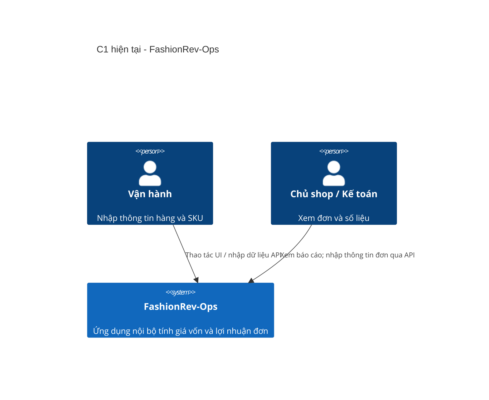
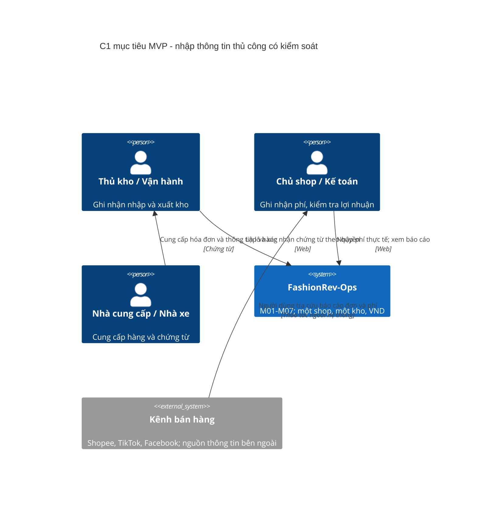
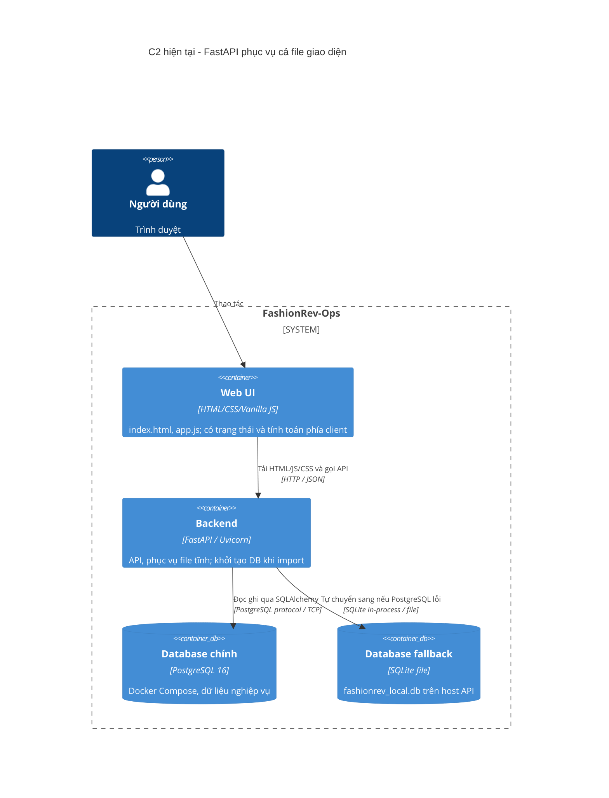
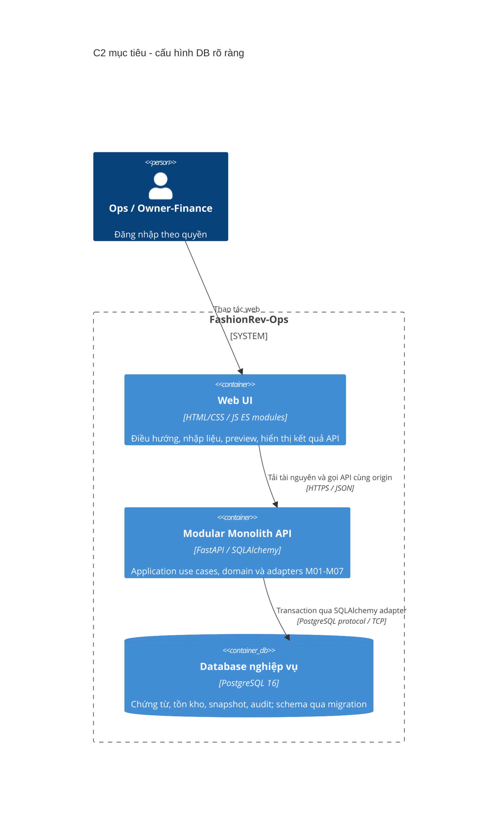
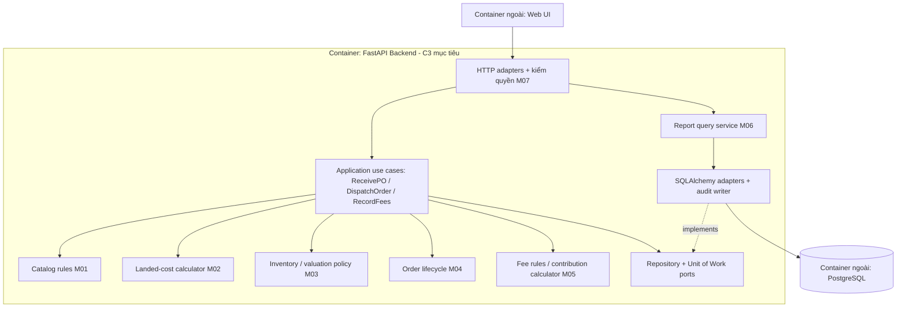

# Kiến trúc FashionRev-Ops — baseline đề xuất theo arc42 và C4

**Ngày rà soát:** 15/09/2026. **Trạng thái:** Đề xuất để triển khai; chưa phải xác nhận hệ thống đã đạt kiến trúc này. Các mục ghi **Hiện tại** mô tả mã nguồn đã đọc; **Mục tiêu** mô tả thay đổi cần thực hiện. Chỉ chuyển trạng thái quyết định/hạng mục sau khi có bằng chứng triển khai và kiểm chứng.

Tài liệu dùng 12 phần của [arc42](https://arc42.org/overview/). C4 cung cấp các mức nhìn kiến trúc; chỉ dùng sơ đồ có ích, không bắt buộc đủ bốn mức, không quy định cấu trúc thư mục hay design pattern. [Hướng dẫn sơ đồ C4 chính thức](https://c4model.com/diagrams).

## 1. Giới thiệu và mục tiêu

FashionRev-Ops hỗ trợ shop quần áo online nhập hàng sẵn tính giá vốn lô nhập và lợi nhuận đóng góp của đơn bán theo các khoản chi phí được ghi nhận.

| Đối tượng | Mục tiêu cần hỗ trợ | Bằng chứng nghiệm thu |
|---|---|---|
| Thủ kho/vận hành | Ghi nhận đúng SKU, số lượng và chi phí nhập; xuất trong giới hạn tồn | Phiếu nhận/xuất truy vết được; không ghi tồn hai lần |
| Chủ shop/kế toán | Hiểu doanh thu, phí bán hàng, COGS và lợi nhuận đóng góp | Tổng báo cáo bằng tổng các đơn đủ điều kiện trong cùng kỳ |
| Người bảo trì | Sửa quy tắc tài chính mà không sửa nhiều nơi | Domain test độc lập framework; UI/API dùng cùng quy tắc và ví dụ |

**Ba mục tiêu chất lượng ưu tiên:** đúng số tiền; toàn vẹn tồn kho/snapshot; truy vết được nguồn số liệu. Phản hồi nhanh và khả năng mở rộng được đo sau các bất biến trên.

**MVP đề xuất:** một shop, một kho, VND; M01–M07 theo bảng ở mục 5; phí thực tế nhập tay. Chỉ báo cáo **lợi nhuận đóng góp đơn hàng**, chưa gọi là lợi nhuận ròng toàn doanh nghiệp hoặc số tiền vào ngân hàng. M08 hàng hoàn, M09 chi phí vận hành/dòng tiền, import đối soát nâng cao và kết nối sàn thuộc Phase 2. Code hoàn hàng hiện có cần được đánh giá và xử lý dữ liệu chuyển đổi, không mặc nhiên coi là đã đạt yêu cầu Phase 2.

## 2. Ràng buộc kiến trúc

| Loại | Baseline và giới hạn |
|---|---|
| Nghiệp vụ đề xuất | Một shop/một kho; không thiết kế multi-tenant hoặc nhiều tiền tệ trong MVP |
| Công nghệ kế thừa | Python/FastAPI, SQLAlchemy, PostgreSQL 16; HTML/CSS/JavaScript trên trình duyệt |
| Định hướng refactor | Giữ stack; tách frontend thành ES modules; backend modular monolith trong một tiến trình triển khai |
| Dữ liệu hiện hữu | DBML, SQL init, ORM và SQLite local đang có khác biệt; migration phải đối chiếu dữ liệu trước khi thay schema |
| Tích hợp | Repo chưa có đồng bộ Shopee/TikTok thật; tên kênh và Strategy tính phí không phải kết nối sàn |
| Quyết định còn mở | Policy giá vốn xuất, độ chính xác giá vốn đơn vị, phân bổ phần dư, quyền xác nhận/điều chỉnh |

Stack và một shop/một kho là baseline làm việc của dự án, không phải yêu cầu do C4/arc42 áp đặt. Chưa có cam kết lưu lượng production; tải tham chiếu để thử nghiệm nằm ở mục 10.

## 3. Bối cảnh và phạm vi — C4 System Context

### Hiện tại: ứng dụng nội bộ, chưa có tích hợp marketplace



Actors là vai trò nghiệp vụ; sơ đồ này không xác nhận đã có đăng nhập/RBAC. Giao diện có dữ liệu mẫu; đường kết nối trực tiếp tới API sàn trong tài liệu cũ chưa có triển khai tương ứng.

### Mục tiêu MVP: cùng phạm vi nội bộ, nguồn thông tin ngoài hệ thống qua người nhập



Không có mũi tên gọi API giữa ứng dụng và sàn trong MVP. Khách mua hàng không trực tiếp dùng ứng dụng này; supplier và sàn không có tài khoản nội bộ. Interface nghiệp vụ gồm chứng từ nhập, thông tin đơn, các khoản phí; interface kỹ thuật MVP là Web UI và REST API nội bộ.

## 4. Chiến lược giải pháp

- **Modular monolith:** phân ranh giới theo trách nhiệm M01–M07, dùng chung PostgreSQL và transaction cho các thay đổi liên quan nhập/xuất. Chưa cần microservices, message broker hay triển khai từng module riêng.
- **Luồng phụ thuộc:** HTTP adapter → application use case → domain thuần. Application dùng port đọc/ghi; SQLAlchemy adapter triển khai port. Composition root nối các thành phần. Domain không import FastAPI, SQLAlchemy hoặc frontend.
- **Một nguồn quy tắc tài chính:** domain backend là kết quả có thẩm quyền; UI preview qua API dùng cùng calculator. Không duy trì công thức khác nhau giữa modal, dashboard và dịch vụ đơn hàng.
- **Chứng từ và snapshot:** xác nhận nhập/xuất là transaction; nhật ký biến động là nguồn truy vết. Snapshot COGS dòng đơn không đổi khi nhận lô mới; phí thực tế bổ sung có lịch sử riêng.
- **Refactor tăng dần:** ghi characterization tests cho hành vi cần giữ; sửa lỗi bằng ví dụ nghiệp vụ đã thống nhất; chuyển lần lượt một use case, không đổi toàn bộ schema và UI trong một bước.

## 5. Góc nhìn khối xây dựng — C4 Container và Component

### C2 hiện tại



Nguồn: [main.py](../../backend/app/main.py), [database.py](../../backend/app/core/database.py), [docker-compose.yml](../../docker-compose.yml). Hai database là lựa chọn runtime hiện tại, không có cơ chế sao chép hay đồng bộ lẫn nhau. SQLite là data store trong cùng host, không phải DB server có cổng riêng.

### C2 mục tiêu MVP



Tách UI/API thành C4 containers vì mã chạy ở trình duyệt và server; chúng vẫn có thể được đóng gói/phục vụ trong cùng bản triển khai. SQLite chỉ được giữ làm profile thử nghiệm tường minh nếu có nhu cầu; không tự fallback trong vận hành.

| Module | Trách nhiệm và quyền sở hữu dữ liệu mục tiêu |
|---|---|
| M01 Danh mục & đối tác | Category/product/variant, supplier; SKU định danh; không tự tăng tồn khi tạo SKU |
| M02 Nhập hàng & landed cost | Phiếu nhập nháp/đã nhận, dòng nhập, chi phí và kết quả phân bổ |
| M03 Tồn kho & giá vốn | Biến động nhập/xuất, số dư lượng/giá trị, policy valuation; cung cấp snapshot khi xuất |
| M04 Đơn bán | Đơn/dòng, chuyển trạng thái xuất, snapshot COGS liên kết chứng từ xuất |
| M05 Phí bán hàng & đối soát | MVP ghi phí thực tế thủ công và nguồn chứng từ; import/đợt đối soát/chênh lệch nâng cao Phase 2 |
| M06 Báo cáo | Read models tổng hợp từ chứng từ đủ điều kiện; không cập nhật số dư hoặc tự tạo phí |
| M07 Quản trị & kiểm soát | Users/roles, kiểm quyền, audit và cấu hình; không chứa công thức landed cost |
| M08 Hàng hoàn | Phase 2: kiểm hàng, nhập lại/hủy, hoàn tiền và điều chỉnh có truy vết |
| M09 Chi phí vận hành & dòng tiền | Phase 2: chi phí ngoài đơn, khoản thu/chi; nền tảng cho P&L rộng hơn |

### C3 mục tiêu: trách nhiệm bên trong Backend API



Ký pháp C3 ở trên dùng Mermaid flowchart; hộp domain và application cùng chạy trong API, không phải dịch vụ triển khai riêng. M06 dùng cùng calculator/định nghĩa chỉ tiêu với M05; không sao chép công thức vào SQL và JavaScript độc lập. Chỉ thêm repository abstraction nơi cần transaction/test boundary. Không tạo một class cho mỗi hàm để đạt hình thức. C4 Code diagram chưa cần; chỉ bổ sung cho quyết định phức tạp mà code/test chưa giải thích đủ.

## 6. Góc nhìn runtime

### R01 — Xác nhận phiếu nhập (mục tiêu)

```mermaid
sequenceDiagram
    actor Ops as Thủ kho
    participant API as API / ReceivePO
    participant Calc as LandedCostCalculator
    participant DB as PostgreSQL transaction
    Ops->>API: Xác nhận PO + phiên bản / khóa chống gửi lặp
    API->>API: Kiểm quyền và dữ liệu
    API->>DB: BEGIN; khóa PO và SKU theo thứ tự ổn định
    DB-->>API: PO nháp + số dư hiện tại
    API->>Calc: Giá mua, lượng, cước, phụ phí, bao bì
    Calc-->>API: Phân bổ có bảo toàn tổng tiền
    API->>DB: Ghi kết quả nhập + biến động tồn + audit + trạng thái RECEIVED
    alt Tất cả hợp lệ
        API->>DB: COMMIT
        API-->>Ops: Phiếu đã nhận, tồn mới
    else Sai trạng thái / lỗi ghi dữ liệu
        API->>DB: ROLLBACK
        API-->>Ops: Lỗi có thể xử lý; tồn không đổi
    end
```

Request đã hoàn thành được nhận diện trước khi ghi tiếp: trả kết quả cũ hoặc conflict rõ ràng, không cộng tồn lần nữa. Preview không ghi DB. SKU tạo kèm phiếu cần cùng transaction hoặc ghi rõ hành vi độc lập trong use case.

### R02 — Xuất đơn và snapshot giá vốn (mục tiêu)

```mermaid
sequenceDiagram
    actor Ops as Người có quyền xuất hàng
    participant UC as DispatchOrder
    participant Val as ValuationPolicy M03
    participant DB as PostgreSQL transaction
    Ops->>UC: Xác nhận xuất đơn
    UC->>DB: BEGIN; khóa đơn và các SKU theo ID
    DB-->>UC: Trạng thái đơn, lượng và giá trị tồn
    UC->>UC: Gộp nhu cầu cùng SKU; kiểm đủ tồn và trạng thái
    UC->>Val: Yêu cầu giá vốn theo policy được duyệt
    Val-->>UC: Snapshot lượng/giá trị, nguồn và phiên bản policy
    UC->>DB: Ghi snapshot + biến động xuất + audit + trạng thái
    alt Ghi thành công
        UC->>DB: COMMIT
        UC-->>Ops: Đơn đã xuất; snapshot cố định
    else Thiếu tồn / thiếu nguồn giá vốn / lỗi
        UC->>DB: ROLLBACK
        UC-->>Ops: Đơn chưa xuất; không ghi một phần
    end
```

R02 phụ thuộc ADR-03 còn mở. Không dùng tỷ lệ tùy ý của giá bán thay cho nguồn giá vốn thiếu. Nhập lô sau không sửa snapshot cũ. Ghi thêm phí qua M05 có audit và cập nhật báo cáo theo quy tắc kỳ; không sửa COGS xuất. Snapshot bảo vệ giá vốn lịch sử, không có nghĩa mọi chỉ tiêu của đơn vĩnh viễn không đổi.

## 7. Góc nhìn triển khai

**Hiện tại:** Uvicorn chạy trên máy host; [README](../../Readme.md) hướng dẫn cổng 8088, `main.py` có nhánh chạy trực tiếp 8000. Compose chỉ chạy PostgreSQL 16, host `5433` → container `5432`, volume `postgres_data`; file init chỉ chạy khi khởi tạo volume trống. Không coi init SQL là migration cho DB đã có dữ liệu.

**Mục tiêu local:** thống nhất API/UI `localhost:8088`, PostgreSQL `localhost:5433`; migration chạy riêng, seed demo là lệnh chủ động. **Mục tiêu triển khai dùng chung:** browser → HTTPS reverse proxy → API (mạng riêng) → PostgreSQL (mạng riêng, volume bền vững). Proxy/TLS và đóng gói API còn là công việc triển khai. Credential qua cấu hình môi trường; ví dụ công khai dùng placeholder; DB mất kết nối làm readiness thất bại và trả lỗi có kiểm soát.

Quy trình release: backup → kiểm migration trên bản phục hồi → migration có kiểm soát → khởi động API → smoke tests → đối chiếu số liệu. Chỉ khôi phục backup theo kế hoạch rollback đã kiểm thử; không mặc định downgrade schema luôn an toàn. Backup cần đặt ngoài volume làm việc; mục tiêu RPO/RTO ở mục 10 là đề xuất, chưa có bằng chứng đạt.

## 8. Khái niệm xuyên suốt

- **Tiền và làm tròn:** `Decimal` phía Python, `NUMERIC` trong DB, giá trị tiền API dạng chuỗi có hợp đồng rõ ràng. VND hiển thị nguyên; độ chính xác nội bộ của giá vốn đơn vị còn theo ADR-04. Phân bổ tổng bằng phần dư xác định, không làm mất tiền khi chia không hết.
- **Ngữ nghĩa doanh thu/phí:** baseline gross sales là tổng tiền hàng trước voucher shop; voucher và từng khoản phí được trừ đúng một lần. Thiếu phí khác phí bằng 0; ghi trạng thái thiếu để báo cáo chưa hoàn tất. Phí nhập vốn hóa khác bao bì giao hàng. Phí thực tế không tự bị thay bằng mức ước tính Strategy.
- **Lợi nhuận đóng góp:** doanh thu theo định nghĩa trên − voucher shop − phí sàn − ship shop chịu − bao bì giao − COGS xuất. Mỗi trường phải ghi đơn vị per-unit/per-line/per-order. Tổng kỳ dùng tổng tiền; tỷ suất là tổng lợi nhuận / tổng doanh thu, không trung bình đơn giản tỷ lệ từng dòng. Doanh thu bằng 0 trả tỷ suất không áp dụng.
- **Transaction:** application sở hữu commit/rollback; domain không commit. Khóa dữ liệu/conditional update và unique constraints bảo vệ tồn, mã chứng từ, idempotency. Không chỉ dựa vào kiểm tra trước ở UI.
- **Quyền và audit:** kiểm quyền tại API; ẩn nút không đủ. Audit actor/time/action/document/before-after, hạn chế quyền sửa audit; dùng cùng transaction với nghiệp vụ cần truy vết. Không ghi secret vào log.
- **Thời gian/lỗi:** lưu timestamp có timezone, hiển thị giờ shop; kỳ báo cáo phải chỉ rõ ngày ghi nhận nào và biên thời gian. HTTP adapters chuyển domain errors thành lỗi 4xx/5xx có mã; UI có loading/empty/error và retry phù hợp.
- **Schema/test:** một lịch sử migration có version; DBML mô tả thiết kế, ORM phục vụ runtime. CI kiểm schema tương thích và transaction trên PostgreSQL; SQLite không thay thế bằng chứng về khóa/concurrency.

## 9. Quyết định kiến trúc (ADR rút gọn)

Các dòng dưới là hồ sơ đề xuất, **chưa được chấp nhận hoặc triển khai**. Khi chốt cần ghi người quyết định, ngày, ví dụ nghiệp vụ và liên kết commit/test.

| ADR / trạng thái | Bối cảnh, phương án và hướng đề xuất | Hệ quả / điều kiện chốt |
|---|---|---|
| ADR-01 — Đề xuất | Team nhỏ, transaction liên module; chọn modular monolith thay vì microservices | Đơn giản vận hành; phải giữ boundary module và phụ thuộc rõ ràng |
| ADR-02 — Đề xuất | PG lỗi đang tự chuyển SQLite; chọn PG tường minh và migration versioned | Lỗi DB hiển thị rõ; cần migration và seed command trước khi bỏ init/fallback |
| ADR-03 — Mở | So FIFO với bình quân liên hoàn; ưu tiên xem xét bình quân liên hoàn cho một kho | Chưa đổi công thức. Fixture: nhập 10@100, 10@200, xuất 5 → FIFO COGS 500/tồn 2500; bình quân COGS 750/tồn 2250. Cần thêm tồn đầu, nhập sau bán, hết tồn, chi phí bổ sung và hoàn hàng |
| ADR-04 — Mở | Giá vốn đơn vị có thể lẻ VND; cân nhắc scale cao nội bộ và số tiền dòng nguyên | Chốt rounding, phần dư, bảo toàn giá trị tồn/COGS bằng fixtures chia cước không hết; đồng bộ DBML/API/test |
| ADR-05 — Đề xuất | Phí sàn thay đổi và phí thực tế có thể 0; MVP nhập tay thực tế, lưu nguồn | Không hứa tính phí chính thức; Strategy ước tính nếu giữ phải có nhãn và không ghi đè actual |
| ADR-06 — Đề xuất | Giá vốn cần lịch sử ổn định; snapshot tại xác nhận xuất, biến động tồn + audit cùng transaction | Điều chỉnh qua nghiệp vụ riêng; migrate dữ liệu cũ chưa có nguồn thay vì tự suy đoán |
| ADR-07 — Đề xuất | Công thức hiện tại chưa có toàn bộ chi phí/thu chi; dùng contribution margin trong MVP | M08/M09 và đối soát nâng cao Phase 2; cần phân loại dữ liệu hoàn legacy trước nghiệm thu báo cáo |

## 10. Yêu cầu chất lượng và cách đo

Đây là **ngưỡng nghiệm thu đề xuất, chưa đo**. Tải tham chiếu: 10.000 SKU, 100.000 đơn tối đa 5 dòng/đơn, 20 người đồng thời; ghi rõ CPU/RAM/phiên bản DB và query plan khi benchmark.

| ID / ưu tiên | Kích thích và môi trường | Phản hồi / thước đo / kiểm chứng |
|---|---|---|
| Q01 / P0 | Nhập lô nhiều SKU, quỹ cước không chia hết | Tổng phân bổ đúng quỹ cước ở đơn vị tiền đã chốt; test số học và integration fixtures |
| Q02 / P0 | Gửi xác nhận nhập/xuất cùng chứng từ 10 lần đồng thời trên PG | Chỉ 1 thay đổi tồn hợp lệ; unique/idempotency integration test |
| Q03 / P0 | Hai đơn cùng mua SKU còn 1, mỗi đơn yêu cầu 1 | Đúng 1 đơn xuất thành công; số dư 0, không âm; concurrency test PG |
| Q04 / P0 | Lỗi ghi ở dòng cuối trong phiếu 3 dòng | Chứng từ/tồn/snapshot/audit không ghi một phần; fault-injection integration test |
| Q05 / P0 | Xuất đơn rồi nhập lô giá khác | Snapshot đơn cũ giữ nguyên; báo cáo lịch sử COGS không đổi; regression fixture |
| Q06 / P0 | Truy cập API báo cáo bằng role Ops bị cấm | 403, không trả dữ liệu tài chính; authorization integration test |
| Q07 / P0 | Tổng hợp cùng kỳ/kênh/trạng thái với dữ liệu chi tiết | Chênh lệch tổng tiền 0 theo rounding đã chốt; test reconciliation, gồm voucher/ship/zero fee |
| Q08 / P1 | Preview tối đa 100 dòng và tải tham chiếu đã nêu | API p95 ≤ 500 ms; báo cáo kỳ p95 ≤ 2 s; đo riêng server/network, không cam kết trước benchmark |
| Q09 / P1 | PostgreSQL mất kết nối khi khởi động | Không chuyển DB khác, không seed; readiness thất bại; phục hồi kết nối có kiểm chứng |
| Q10 / P1 | Phục hồi từ backup daily trên máy thử nghiệm | RPO ≤ 24 h, RTO ≤ 2 h; thực hiện restore drill và đối chiếu counts/tổng tiền |

## 11. Rủi ro và nợ kỹ thuật

| Mức | Rủi ro đã thấy / phần chưa chốt | Hành động và người phụ trách đề xuất |
|---|---|---|
| Cao | Nhiều công thức, voucher/ship có thể lệch giữa lưu và báo cáo | Backend + người phụ trách nghiệp vụ: glossary, calculator chung, Q01/Q07 |
| Cao | COGS hiện lấy lô mới nhất, có fallback tỷ lệ giá bán | Nghiệp vụ + backend: ADR-03/04; đối chiếu tồn đầu, nguồn snapshot; không viết lại lịch sử không có chứng từ |
| Cao | DB auto-fallback/auto-seed, schema init/ORM/DBML khác nhau | Backend: ADR-02, migration rehearsal, explicit profile; Q09 |
| Cao | Thiếu kiểm chứng gửi lặp, cạnh tranh tồn, rollback | Backend: transaction boundary, locks/constraints; Q02–Q04 trên PG |
| Cao | Tài liệu phân quyền/hoàn hàng/tích hợp vượt hiện trạng | Người phụ trách sản phẩm + backend/UI: scope có trạng thái, M07, chính sách dữ liệu legacy |
| Vừa | Snapshot có thể bị hiểu nhầm là mọi số liệu bất biến; phí đến trễ | Nghiệp vụ: xác định kỳ ghi nhận/điều chỉnh và nhãn incomplete; giữ audit |
| Vừa | Sơ đồ/README song ngữ và paths có thể lệch sau refactor | Người bảo trì: một baseline chính, link check và cập nhật tài liệu cùng PR |

## 12. Thuật ngữ

| Thuật ngữ | Nghĩa trong baseline này |
|---|---|
| Module / feature / function | Miền trách nhiệm nghiệp vụ / khả năng mang giá trị / thao tác hoặc quy tắc cụ thể; không đồng nghĩa màn hình |
| SKU | Mã định danh biến thể sản phẩm, ví dụ áo đen size M |
| PO / receipt | Phiếu nhập dự kiến / sự kiện xác nhận hàng thực nhận; không mặc định tạo nháp đã tăng tồn |
| Landed cost | Chi phí mua và chi phí nhập được phân bổ vào hàng đã nhận |
| COGS snapshot | Giá vốn lượng hàng xuất của dòng bán tại thời điểm xuất, kèm nguồn và policy |
| Inventory value | Giá trị hàng còn tồn, khác COGS của hàng đã bán |
| Contribution margin | Lợi nhuận đóng góp sau các chi phí gắn đơn được theo dõi; chưa gồm M09 |
| Settlement | Khoản đối soát/tiền sàn thanh toán; khác lợi nhuận và khác số dư ngân hàng |
| Idempotency / Unit of Work | Gửi lại không ghi nghiệp vụ hai lần / phạm vi transaction thành công hoặc thất bại cùng nhau |
| As-is / target / ADR | Hiện trạng đã kiểm tra / thiết kế mục tiêu / hồ sơ quyết định có lý do và hệ quả |
