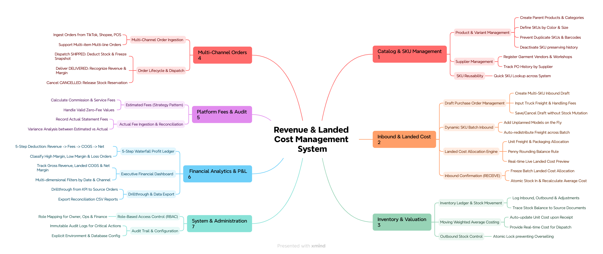
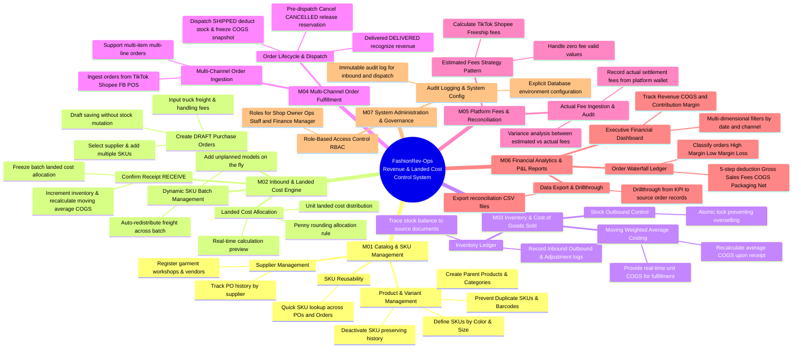
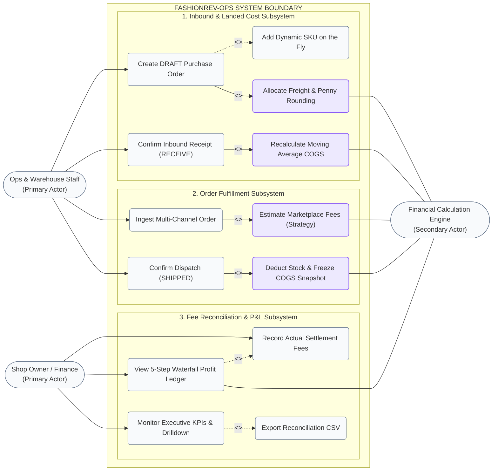

# Business Architecture Specification: System Mindmap & Use Case Diagrams

---

## 1. System Mindmap Diagram (3-Tier Hierarchical Structure)

The system is structured hierarchically: **Modules $\rightarrow$ Features $\rightarrow$ Functions / User Stories**.

### 1.1 Visual Mindmap (Rendered Image & Mermaid)

---

## 2. UML Use Case Diagram

---

## 3. Actor & Role Specifications

| Actor | Role Type | Core Responsibilities |
|---|---|---|
| **Ops & Warehouse Staff** *(UserOps)* | Primary Actor (Operations) | Creates PO drafts, enters truck shipping & handling expenses, adds unplanned SKUs upon truck unloading, confirms inbound physical receipt, dispatches outgoing orders. |
| **Finance Manager / Accountant** *(UserFinance)* | Primary Actor (Finance) | Inspects order waterfall deductions, records actual fees from platform payout statements, audits packaging expenses, exports periodic P&L reports. |
| **Shop Owner / Administrator** *(UserOwner)* | Primary Actor (Governance) | Monitors high-level KPI dashboard, approves manual stock adjustments, manages team roles, configures system environments. |
| **Financial Calculation Engine** *(SystemEngine)* | Secondary Actor (Automated Engine) | Automatically executes freight allocation algorithms, computes moving weighted average COGS, freezes immutable order snapshots, renders 5-step waterfall profit deductions. |

---

## 4. Functional Scope Matrix

| Mindmap Module | In-Scope Features (MVP Release) | Deliberately Out-of-Scope (Phase 2 / Excluded) |
|---|---|---|
| **1. Catalog & SKUs (M01)** | • Product, Color/Size Variant SKU, and Supplier CRUD. • Duplicate SKU/Barcode prevention. • Soft SKU deactivation preserving transaction integrity. | • Bill of Materials (BOM) garment production. • Multi-brand & multi-subsidiary enterprise structures. |
| **2. Inbound & Landed Cost (M02)** | • DRAFT PO creation, Dynamic SKU modal. • Quantity-based freight allocation with penny rounding. • Live modal preview. • Atomic & idempotent PO confirmation (RECEIVE). | • Partial inbound receipts across multiple dates. • Advanced supplier accounts payable (AP) ledger. |
| **3. Inventory & COGS (M03)** | • Stock movement ledger (Inbound/Outbound/Adjustment). • Moving Weighted Average costing. • Frozen COGS snapshot upon SHIPPED. • Concurrency-safe overselling prevention. | • Multi-warehouse physical locations and bin routing. • Expiration & shelf-life tracking. |
| **4. Order Management (M04)** | • Multi-channel ingestion (TikTok Shop, Shopee, FB POS). • Multi-line item orders. • State machine: `PENDING` $\rightarrow$ `SHIPPED` $\rightarrow$ `DELIVERED` / `CANCELLED`. | • Real-time live open API webhook connectors. • Automated warehouse wave picking. |
| **5. Platform Fees (M05)** | • Estimated fee strategies for Shopee/TikTok/FB POS. • Actual wallet settlement fee ingestion. • Zero fee handling (Shop subsidized free shipping). | • Automated bulk Excel payout statement parsing. • Direct corporate bank API integrations. |
| **6. Analytics & P&L (M06)** | • 5-step order waterfall profit ledger. • Profit tier classification (High Margin, Low Margin, Loss). • Executive dashboard with date & channel filters. • Source order drillthrough & CSV export. | • Company-wide net profit including overheads (M09 - Rent, Payroll, Ads). • Machine Learning sales forecasting. |
| **7. Administration (M07)** | • 3 internal roles (Owner, Ops, Finance). • Audit trail for inbound receipts and outbound dispatches. • Explicit `.env` database configuration. | • Single Sign-On (Google SSO, LDAP). • Multi-tenant SaaS architecture. |
| **8. Return Triage (M08)** | *Excluded from MVP* | • Returned garment triage, inspection, restock, or scrap write-off (Scheduled for Phase 2). |
