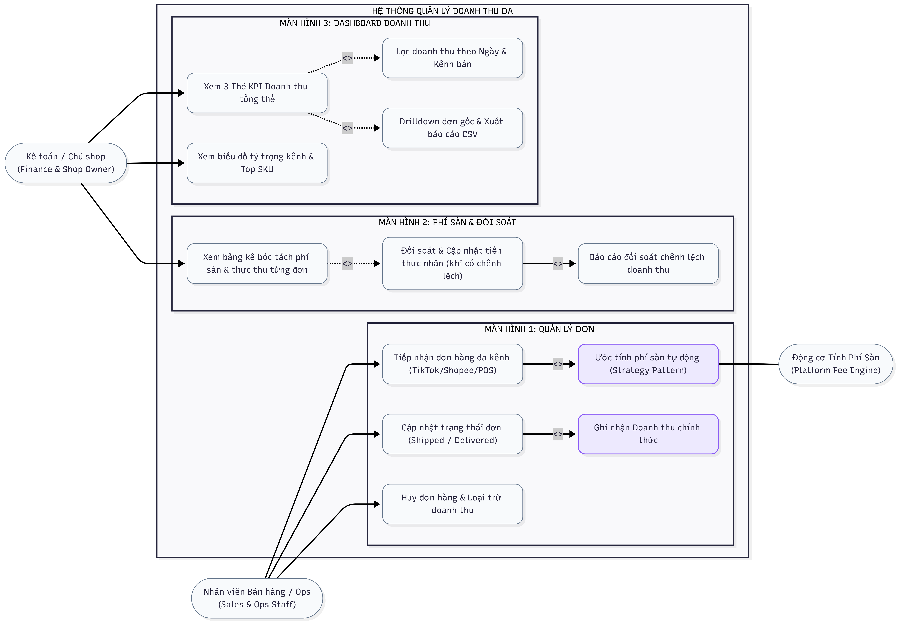

# Đặc Tả Kiến Trúc Nghiệp Vụ & Use Case: Hệ Thống Quản Lý Doanh Thu Đa Kênh

> **Hệ thống:** Multi-Channel Revenue Management System (Hệ thống Quản lý Doanh thu Đa kênh)  
> **Mục tiêu:** Quản lý dòng tiền bán hàng từ nhiều kênh (TikTok Shop, Shopee, Facebook POS), tự động bóc tách phí sàn và đối soát tiền thực thu về ví.

---

## 1. Sơ Đồ Use Case Diagram (Chuẩn UML)

Sơ đồ thể hiện sự tương tác giữa 2 Tác nhân người dùng (Sales & Ops Staff, Finance Manager & Shop Owner) và 1 Động cơ tính toán tự động (Platform Fee Engine) được phân bổ trực quan theo 3 màn hình giao diện:

> **Quy ước trong sơ đồ:**
> * **Hình khối màn hình:** Phân chia ranh giới chức năng theo từng không gian làm việc của người dùng.
> * **Quan hệ `<<include>>`:** Chức năng bắt buộc chạy kèm tự động (Ví dụ: Tiếp nhận đơn bắt buộc đi kèm Ước tính phí sàn; Cập nhật đơn Delivered bắt buộc đi kèm Ghi nhận doanh thu).
> * **Quan hệ `<<extend>>`:** Nhánh chức năng mở rộng/tùy chọn theo điều kiện phát sinh (Ví dụ: Đối soát tiền thực nhận khi có chênh lệch; Lọc đa chiều & Drilldown xuất CSV từ Thẻ KPI).

---

## 2. Ma Trận Ánh Xạ 3 Chiều: Màn Hình — Use Case — Vai Trò (Role)

Bảng dưới đây xác định rõ ràng: **Tính năng nào, do Vai trò nào thực hiện, trên Màn hình giao diện nào**:

| Màn hình giao diện (Screen) | Tên Use Case / Tính năng chi tiết | Vai trò thực hiện (Role) | Ý nghĩa nghiệp vụ & Kiểm soát |
|---|---|:---:|---|
| **Màn hình 1: Quản lý Đơn hàng** *(Orders Management Tab)* | **UC01: Tiếp nhận đơn hàng đa kênh (TikTok/Shopee/POS)** | `Sales / Ops` `Shop Owner` | Nhập đơn từ TikTok Shop, Shopee, FB POS (SKU, số lượng, giá bán, voucher chiết khấu). Hỗ trợ đơn nhiều dòng hàng. |
| | **UC02: Ước tính phí sàn tự động (Strategy Pattern)** | `Platform Fee Engine` *(Hệ thống tự động)* | Tự động áp dụng công thức tính hoa hồng và phí dịch vụ theo từng sàn để hiển thị phí dự kiến. |
| | **UC03: Cập nhật trạng thái đơn (Shipped $\rightarrow$ Delivered)** | `Sales / Ops` | Khi giao thành công (`DELIVERED`), hệ thống **chính thức ghi nhận Doanh thu** vào kỳ báo cáo. |
| | **UC04: Hủy đơn hàng & Loại trừ doanh thu (Cancelled)** | `Sales / Ops` | Xử lý các đơn bị hủy/boom hàng, tự động loại trừ khỏi doanh thu thực tế. |
| **Màn hình 2: Phí sàn & Đối soát Ví** *(Platform Fees & Settlement Tab)* | **UC05: Xem bảng kê bóc tách phí sàn & thực thu từng đơn** | `Finance Manager` `Shop Owner` | Bóc tách minh bạch từng khoản: Doanh thu gộp $\rightarrow$ Phí hoa hồng $\rightarrow$ Phí cố định $\rightarrow$ Tiền sàn quyết toán. |
| | **UC06: Đối soát & Cập nhật tiền thực nhận (khi có chênh lệch)** | `Finance Manager` | Mở sao kê ví sàn và cập nhật lại số tiền thực nhận (`Actual Settlement Amount`) nếu bị sàn trừ thêm phí phát sinh. |
| | **UC07: Báo cáo đối soát chênh lệch doanh thu** | `Finance Manager` `Shop Owner` | So sánh tiền dự kiến thu vs Tiền thực tế nhận về ví để phát hiện chênh lệch bất thường. |
| **Màn hình 3: Dashboard Doanh thu** *(Revenue Dashboard Tab)* | **UC08: Xem 3 Thẻ KPI tài chính cấp cao** | `Shop Owner` `Finance Manager` | Giám sát 3 chỉ số cốt lõi: **Tổng Doanh thu gộp (Gross Sales)**, **Tổng Phí sàn bị trừ**, **Tổng Tiền thực nhận về ví**. |
| | **UC09: Lọc doanh thu theo Ngày & Kênh bán** | `Shop Owner` `Finance Manager` | Lọc số liệu linh hoạt theo: Hôm nay, 7 ngày qua, Tháng này và theo từng Kênh (Shopee / TikTok / POS). |
| | **UC10: Xem biểu đồ cơ cấu kênh & Top SKU** | `Shop Owner` `Finance Manager` | Xem biểu đồ tròn tỷ trọng doanh thu các sàn và bảng xếp hạng Top SKU mang lại doanh thu cao nhất. |
| | **UC11: Drilldown đơn gốc & Xuất báo cáo CSV** | `Finance Manager` `Shop Owner` | Bấm vào thẻ KPI để truy ngược danh sách đơn hàng chi tiết và xuất file báo cáo phục vụ kế toán. |

---

## 3. Ma Trận Ranh Giới Phạm Vi Chức Năng (Functional Scope Matrix)

Phân định dứt khoát phạm vi của **Hệ thống Quản lý Doanh thu Đa kênh**:

| Phân hệ nghiệp vụ | Tính năng trong phạm vi thực hiện (In-Scope) | Chủ động loại trừ khỏi phạm vi (Out-of-Scope) |
|---|---|---|
| **1. Danh mục & Giá bán** | • Quản lý Sản phẩm, Biến thể SKU theo Màu/Size. • Quản lý Bảng giá niêm yết bán lẻ. • Bật/Tắt trạng thái kinh doanh của SKU. | • Quản lý định mức nguyên phụ liệu may mặc (BOM). • Quản lý chuỗi bán lẻ đa chi nhánh phức tạp. |
| **2. Đơn hàng Đa kênh** | • Nhập đơn hàng từ TikTok Shop, Shopee, Facebook POS. • Đơn có nhiều dòng sản phẩm (Multi-item Multi-line). • Vòng đời đơn: `PENDING` $\rightarrow$ `SHIPPED` $\rightarrow$ `DELIVERED` / `CANCELLED`. • Ghi nhận doanh thu chính thức khi `DELIVERED`. | • Kết nối Webhook / Open API đồng bộ tự động thời gian thực. • Quản lý quy trình chia tuyến giao hàng tự động. |
| **3. Phí sàn & Đối soát** | • Tự động tính phí hoa hồng, phí thanh toán theo Strategy Pattern. • Xử lý phí 0đ hợp lệ (Shop Freeship). • Đối soát số tiền ví sàn thực nhận và báo cáo chênh lệch. | • Tự động đọc file sao kê Excel ngân hàng. • Kết nối trực tiếp API cổng thanh toán ngân hàng. |
| **4. Báo cáo Doanh thu** | • 3 Thẻ KPI tổng quan (Doanh thu gộp, Phí sàn, Thực thu). • Biểu đồ tỷ trọng doanh thu theo kênh (TikTok vs Shopee vs POS). • Bảng xếp hạng Top SKU bán chạy nhất. • Drillthrough xem danh sách đơn gốc và xuất file CSV. | • CẮT BỎ TOÀN BỘ: Tính cước xe tải nhập hàng (Landed Cost). • CẮT BỎ TOÀN BỘ: Giá vốn bình quân liên hoàn (COGS). • CẮT BỎ TOÀN BỘ: Báo cáo Lợi nhuận ròng toàn shop sau chi phí vận hành (Mặt bằng, Lương). |

---

## 4. Đặc Tả Kịch Bản 3 Luồng Nghiệp Vụ Trọng Yếu & Ma Trận Phân Quyền

### 4.1. Kịch bản 1: Tiếp nhận Đơn hàng Đa kênh & Tính Phí Sàn Tự Động (UC-ORDER-01)
* **Actor chính:** `Sales & Ops Staff`
* **Màn hình:** Màn hình 1: Quản lý Đơn hàng
* **Tiền điều kiện:** Sản phẩm/SKU đã tồn tại trong hệ thống.
* **Luồng chính:**
  1. Nhân viên chọn Kênh bán (TikTok Shop, Shopee hoặc FB POS), nhập mã đơn hàng ngoài.
  2. Thêm các dòng sản phẩm (SKU, số lượng, đơn giá) và nhập voucher giảm giá (nếu có).
  3. Hệ thống tự động gọi `Platform Fee Engine` áp dụng Strategy tương ứng để tính:
     $$\text{Phí sàn ước tính} = \text{Phí hoa hồng} + \text{Phí thanh toán} + \text{Phí Freeship}$$
     $$\text{Doanh thu thực thu dự kiến} = \text{Tổng tiền khách trả} - \text{Phí sàn ước tính} - \text{Voucher}$$
  4. Đơn hàng được lưu ở trạng thái `PENDING`.

### 4.2. Kịch bản 2: Vòng Đời Đơn Hàng & Ghi Nhận Doanh Thu Chuẩn (UC-REV-02)
* **Actor chính:** `Sales & Ops Staff`
* **Màn hình:** Màn hình 1: Quản lý Đơn hàng
* **Quy tắc ghi nhận:**
  1. **Xuất hàng (`SHIPPED`):** Doanh thu được đưa vào trạng thái *Đang giao hàng (In-transit)*.
  2. **Giao thành công (`DELIVERED`):** Hệ thống **chính thức cộng tiền vào Báo cáo Doanh thu Thực tế**.
  3. **Hủy đơn (`CANCELLED`):** Hệ thống tự động loại trừ đơn khỏi báo cáo doanh thu thực tế.

### 4.3. Kịch bản 3: Đối Soát Tiền Ví Sàn Thực Nhận & Xuất Báo Cáo (UC-AUDIT-03)
* **Actor chính:** `Finance Manager` / `Shop Owner`
* **Màn hình:** Màn hình 2 (Đối soát) & Màn hình 3 (Dashboard)
* **Luồng chính:**
  1. Kế toán tra cứu các đơn hàng đã giao theo kỳ đối soát, kiểm tra số tiền sàn thực chuyển về ví (`Actual Settlement Amount`).
  2. Nếu có chênh lệch, cập nhật lại số tiền thực nhận; hệ thống tính: $\text{Chênh lệch} = \text{Tiền dự kiến} - \text{Tiền thực nhận}$.
  3. Chuyển sang Dashboard, chọn khoảng ngày và bấm **Xuất báo cáo CSV/Excel** phục vụ quyết toán.

---

### 4.4. Ma Trận Phân Quyền (RBAC Matrix)

| Chức năng nghiệp vụ | Màn hình giao diện | Sales & Ops Staff | Finance Manager | Shop Owner |
|---|---|:---:|:---:|:---:|
| **Tạo và chỉnh sửa đơn hàng** | Màn hình 1 (Đơn hàng) | Cho phép | Chỉ xem | Cho phép |
| **Cập nhật trạng thái (Shipped/Delivered/Cancel)** | Màn hình 1 (Đơn hàng) | Cho phép | Chỉ xem | Phê duyệt |
| **Xem bảng kê bóc tách phí sàn chi tiết** | Màn hình 2 (Đối soát) | Không có quyền | Cho phép | Cho phép |
| **Đối soát & Chốt tiền ví sàn thực nhận** | Màn hình 2 (Đối soát) | Không có quyền | Cho phép | Phê duyệt |
| **Xem 3 Thẻ KPI Dashboard & Biểu đồ doanh thu** | Màn hình 3 (Dashboard) | Không có quyền | Xem toàn bộ | Cho phép |
| **Lọc doanh thu & Xuất báo cáo CSV/Excel** | Màn hình 3 (Dashboard) | Không có quyền | Cho phép | Cho phép |
| **Quản lý danh mục SKU & Bảng giá niêm yết** | Màn hình phụ (Catalog) | Cho phép | Chỉ xem | Cho phép |
